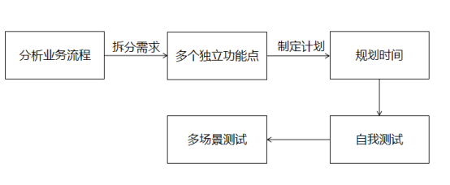
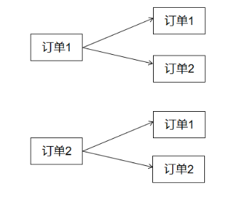
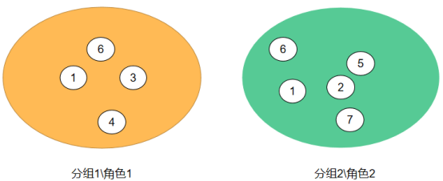
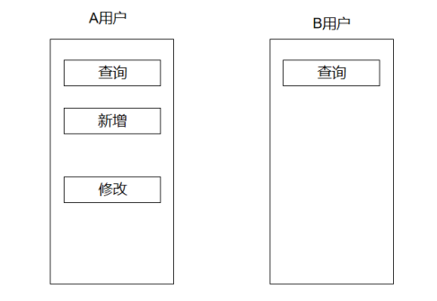

# 1业务思路-研发的开始

很多人说java的工作是面试造火箭，工作打螺丝。技术只是一种实现方式，真正的开发需要先分析业务，然后确定使用那种技术来实现业务。个人而言，真正重要的是分析业务，再确定使用何种技术，然后进行开发。


# 2表设计

## 2.1日志表
核心思想： ***\*什么时间做了什么事\****

主要作用：

(1) 记录业务进行位置

(2) 判断问题原因，快速修改bug

## 2.2字典表

随着业务的不断延伸，需要的文字描述与日俱增，而我们知道以utf-8进行编码，一个汉字至少需要3bit的存储空间，大量的汉字给数据极大的压力。

（1）为了节省数据库资源，加快索引速度。我们往往可以统一设置一个字典表，其他表只需要记录字典表id，便可获取其具体名称。

（2）统一文字描述，多个表之间难以统一对同一个事务的描述，不然设置一个统一的字典，以统一文字描述。

字典表设计：

| 字典表      |              |         |
| ----------- | ------------ | ------- |
| dictId      | dictName     | group   |
| 字典id      | 字典名称     | 分组    |
| partnerinfo | 合作伙伴资料 | partner |
| 唯一索引    |              |         |


## 2.3复杂订单



| 主订单   |            |       |
| -------- | ---------- | ----- |
| orderNum | createDate | total |
| 主订单id | 创建日期   | 总价  |
| 1        | 2022/7/23  | 100   |
| 唯一索引 |            |       |


| 子订单订单 |            |      |       |      |       |
| ---------- | ---------- | ---- | ----- | ---- | ----- |
| orderNum   | subOrderId | name | color | qty  | price |
| 主订单id   | 子订单号   | 名称 | 颜色  | 数量 | 价格  |
| 1          | 1          | a    | 红    | 1    | 11    |
| 1          | 2          | b    | 黄    | 2    | 22    |
| 1          | 3          | c    | 蓝    | 4    | 33    |
| 唯一索引   |            |      |       |      |       |

## 2.4字段设置

建议对表中的数据进行记录，比如数据什么时候修改的，什么时候添加的，什么时候删除的。

额外增加几个字段记录日志，往往在出现问题的时候有奇效。

#  

# 3权限分配

## 3.1用户分级

想要更加系统的控制权限，不仅仅需要确定好权限，更需要的是如何精准的把权限分配给需要权限的用户。

### 3.1.1单个用户

单个用户权限最简单，直接根据业务需要，单独赋权限给单个用户，但是一般不建议这样，往往是极个别超级权限单独赋给单个用户。

### 3.1.2多个用户


实际开发中，可以给多个用户分组或者分配角色，批量赋权给分组或者角色，以方便管理。


## 3.2权限分级

权限多种多样，如何进行区分是需要细心考虑的一件事，可以根据权限的种类进行分组。

### 3.2.1菜单权限

可根据登录用户权限动态获取菜单，以达到控制权限的作用。例如，A用户，可以进行多种操作。B用户，只能进行查询操作。


另外，还可以动态设置菜单访问地址，方便管理。

| 菜单表   |          |        |             |
| -------- | -------- | ------ | ----------- |
| menuId   | menuName | authId | src         |
| 菜单Id   | 菜单名称 | 权限ID | 路径        |
| query    | 查询     | query  | /web/query  |
| update   | 更新     | super  | /web/update |
| add      | 增加     | super  | /web/add    |
| delete   | 删除     | super  | /web/delete |
| 唯一索引 |          |        |             |

但这种方法，只是根据菜单权限显示按钮跳转，并没有真正的鉴权，实际开发过程中，需要谨慎对待。

### 3.2.2令牌权限

限制用户对某些功能的访问。

## 3.3表设计

| 成员权限表 |        |
| ---------- | ------ |
| StaffID    | authId |
| 001        |        |
| 002        |        |
| 003        | super  |
| 唯一索引   |        |


| 角色权限表 |        |
| ---------- | ------ |
| group      | authId |
| a          | query  |
| b          | super  |
| c          | other  |
| 唯一索引   |        |


| 成员关系表 |       |
| ---------- | ----- |
| StaffID    | group |
| 001        | a     |
| 001        | b     |
| 001        | c     |
| 002        | a     |
| 003        | a     |
| 唯一索引   |       |


| 菜单表   |          |        |             |
| -------- | -------- | ------ | ----------- |
| menuId   | menuName | authId | src         |
| 菜单Id   | 菜单名称 | 权限ID | 路径        |
| query    | 查询     | query  | /web/query  |
| update   | 更新     | super  | /web/update |
| add      | 增加     | super  | /web/add    |
| delete   | 删除     | super  | /web/delete |
| 唯一索引 |          |        |             |


| 权限表   |          |             |
| -------- | -------- | ----------- |
| authId   | group    | description |
| 菜单Id   | 分组     | 描述        |
| query    | 增删改查 | 查询        |
| update   | 增删改查 | 更新        |
| add      | 增删改查 | 增加        |
| delete   | 增删改查 | 删除        |
| 唯一索引 |          |             |


# 4测试

## 4.1为什么要测试

写完一个功能点并不意味着结束，需要自己去测试一遍。可能有人会说，不是有测试嘛。测试虽然能测试功能，但是自己写出来的东西，自己测试一定是最容易找到缺陷的。

## 4.2测试应更加关注可能失败的情况

很多人在完成代码书写之后，往往测试成功之后就不在管了，直接转测试了。但是都忽略了一点，那就是失败的场景。在生产环境上，各种情况都有可能会发生，各种奇葩的情况也会发生。我们写代码的时候一定要想到最坏的情况，而不是仅仅关注最好的情况。出现严重生产问题的原因往往是我们写代码时候忽略掉的失败情况引起的。

# 5技术

## 5.1 维护老项目-我们站在巨人的肩膀上

### 5.1.1尽量不要新引入自己的代码

川哥总是说，他不喜欢新写代码，他喜欢更改别人的代码。

仔细想了想，确实。之前的代码和之前的业务流程都是经过生产环境测试的，没有严重bug。如果自己引入新的代码，不仅切入点难找，而且找到切入点进入之后还可能会引入位置的bug。

## 5.2. 技术的新旧不一定重要

### 5.2.1老技术一定新比技术差吗

目前使用的技术是spring2.x、struts2、ibatis等框架，不新，十年前的技术。很多人看到这样的技术，就想着很麻烦。其实spring2.x和springboot相比，原理相同，只不过是简化了开发，使用注解，解决了一定的冗余问题，但底层是一样的。

Struts2和springboot-web-starter相比，设计思想仍然是MVC模型。

ibatis和mybatis-plus相比，我反而更觉得ibatis的自定义程度更高。

就目前个人感觉来言，新技术可能只是比老技术再使用上更加便捷，实际上还是换汤不换药。

## 5.3对外接口

### 5.3.1数据的接收

对外的接口接收外来的报文一定要进行判断，要往最坏的情况想，比如接收的报文中只有一个字符串。

Public void getJson(String name){

If(name==null){

Return;}

}

一定要对报文进行校验，防止出现空指针异常。（2022年8月1日程晨工代码评审中学习）

## 5.4、持久层

### 5.4.1mybatis

（1）最大插入记录

Mybatis有最大插入记录限制，目前我也不知道具体限制多少。

具体实现思路。

限制list传参，大约list的size()的大小为100的时候，需要清空重新赋值再批量传。

List.clean();

## 5.5我以前不知道的工具类

目前，我比较常用的工具类jar包就是`StringUtils`（来自Apache）

### 5.5.1String

1.**比较**

我以前比较喜欢这样`"cxk".equals(变量)`，无论什么时候我都喜欢这样用，其实这样有点蠢。

（1）前缀比较

- **prefix** – 前缀。
- **toffset** – 字符串中开始查找的位置

`public boolean startsWith(String prefix, int toffset)`

`public boolean startsWith(String prefix)`

（2）后缀比较

`String.endsWith("字符串")`

**2.判空**

以前我都是这样写的

```
if(StringUtils.isNotEmpty){
	if(另一个判断)
}
```

川哥的想法：

```
if(StringUtils.isNotEmpty && 另一个判断){
}
```

。。。还真是，&&左边如果为false，就不会去执行右边的逻辑了。

# 6.BUG

## 6.1边界问题

> 中秋节那天版本上线，正在吃饭，突然运维电话打过来，说无法下单。！

（1）下单库存判断

```
if(库存-采购>0)
{
	//可以下单
}else
{
	//无法下单
}
```

- 看似没有什么问题，库存够才能下单，但是当库存是 1 采购 是 1，1-1>0 是不满足的，就无法下单，库存永远会剩1一个。导致版本紧急回退，！！！

  	- 经过川哥的指导，换种思路，| 采购>库存  |  不能下单不就简单了

  ```
  if(采购>库存){
  	//不能下单
  }
  ```

## 6.2大量数据处理问题

1、批处理问题

场景:本系统批量处理数据发送至第三方系统

涉及流程:查询需要处理的ID=》for{封装需要处理的数据> 发送数据=>记录日志}

具体产生问题:查到的id关联数据在for里报错空指针异常，导致程序直接终止。下一次查询还是从空指针异常，阻塞后边的数据处理。解决方案:需要增加日志和补货异常。在for最容易出错的地方写trycatch在catch里continue

# 7.日志

## 7.1日志放在哪？

# 8.态度和细心

- 2022-09-15：发现代码未完成，但是晚上就要上线了，随随便便就测试，然后硬着头皮上线。这明显是不对的。

# 9.业务

## 9.1签收问题


发货时候改变状态，万一B拒收了呢？

## 9.2时间问题

1. 在终端系统中，时间设计是这样的

`开始时间<=时间<结束时间`

## 9.3多场景业务

案例1：采购业务

目前终端业务分为（1）手机终端和（2）家业终端，两种业务类型下单逻辑截然不同。应客户要求上线分货，但是只维护了手机终端业务，并没有考虑家业终端，导致家业无限采购。

